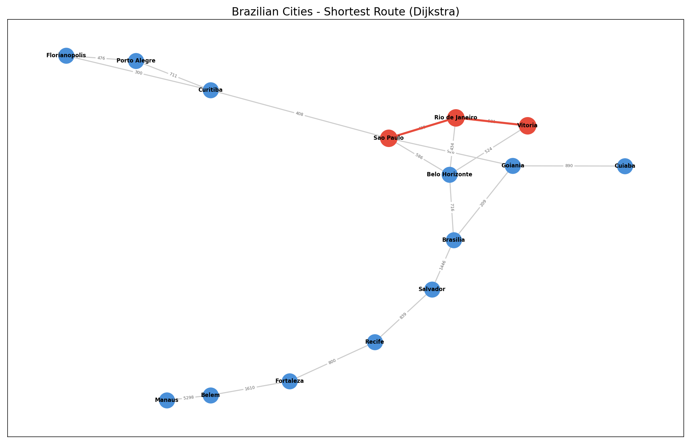

# Shortest Route Finder - Brazilian Cities

[](https://colab.research.google.com/github/geangontijo/dijkstra-cities/blob/main/demo.ipynb)

A hands-on Data Science project implementing **Dijkstra's Algorithm** from scratch in Python to find the shortest route between Brazilian cities.

Built as a practical exercise after studying the Dijkstra chapter from *Grokking Algorithms* (2nd edition).

## Example Output



## How It Works

1. **Graph construction** - 15 Brazilian cities connected by 18 weighted edges (distances in km)
2. **Dijkstra's Algorithm** - Finds the shortest path using a priority queue (`heapq`)
3. **Visualization** - Draws the full graph with `networkx` + `matplotlib`, highlighting the shortest path in red

## Algorithm Overview

The implementation uses 4 data structures (mapped from Grokking Algorithms terminology):

| Grokking Algorithms | Code variable | Purpose |
|---|---|---|
| `costs` | `distances` | Cheapest known distance to each city from start |
| `parents` | `previous` | Which city led to the cheapest path |
| `processed` | `processed` | Set of already-explored cities |
| *(scan for cheapest)* | `heap` | Priority queue for efficient node selection |

## Cities in the Graph

Belem, Belo Horizonte, Brasilia, Cuiaba, Curitiba, Florianopolis, Fortaleza, Goiania, Manaus, Porto Alegre, Recife, Rio de Janeiro, Salvador, Sao Paulo, Vitoria.

## Getting Started

### Requirements

- Python 3.8+
- networkx
- matplotlib

### Installation

```bash
cd dijkstra-cities
pip install -r requirements.txt
```

### Running

```bash
python main.py
```

Choose an origin and destination city from the list. The program will display the shortest path and total distance, then generate a visualization saved as `shortest_route.png`.

## Author

Gean Gontijo
